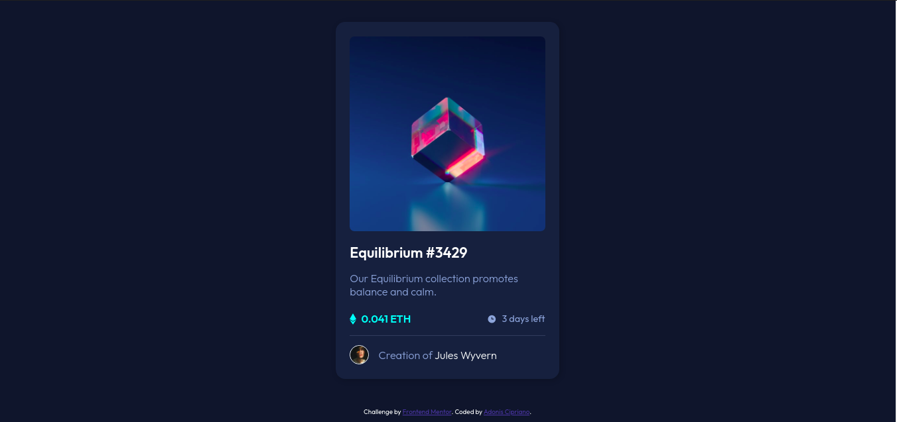

# Frontend Mentor - NFT preview card component solution

This is a solution to the [NFT preview card component challenge on Frontend Mentor](https://www.frontendmentor.io/challenges/nft-preview-card-component-SbdUL_w0U).

In this challenge I used only HTML5 and CSS3 to solve the challenge.

### Screenshot

### Built with

- Semantic HTML5 markup
- CSS custom properties
- Flexbox

## Author

- Frontend Mentor - [@adoniscs](https://www.frontendmentor.io/profile/adoniscs)
- Twitter - [@adoniscipriano](https://www.twitter.com/adoniscipriano)

## Acknowledgments

I would like to thank Tymur Renhach [@tymren608](https://github.com/tymren608) because when I needed to finish the appearance of the image when hovering the mouse, I was inspired by the solution developed by him.
